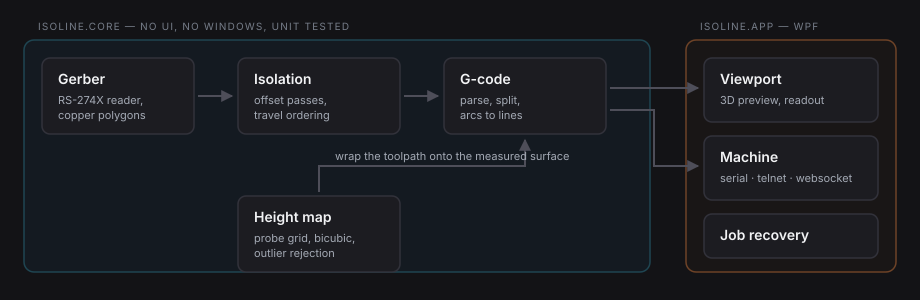

<div align="center">


# Isoline

**Height-mapped isolation milling and G-code sending for Grbl.**

Load a Gerber, probe the board, cut traces that stay the same width across a warped surface.

[](https://github.com/Mithran-MV/isoline/actions/workflows/ci.yml)
[](LICENSE)
[](https://dotnet.microsoft.com/)

</div>

---

## The problem

Engraving a PCB with a V-shaped cutter is unforgiving. The tool cuts a V, so the width of
the trench depends on how deep the tip sits. A board that bows by two tenths of a
millimetre - which every piece of FR4 does - comes out with traces that are too wide in
one corner and not cut through at all in the other.

The fix is to probe the surface, build a height map of the warp, and bend the toolpath to
follow it. Isoline does that, and it does the step before it too: it reads the Gerber and
generates the isolation toolpath itself, so the copper, the height map and the machine all
live in one coordinate system and one preview.



## What it does

- **Gerber in, toolpath out.** Reads RS-274X copper layers and generates multi-pass
  isolation toolpaths with configurable tool width, stepover and depth - no external CAM
  step in between.
- **Probing and height compensation.** Probes a grid over the work area, then wraps the
  toolpath onto the measured surface, splitting long moves and arcs so they follow the
  curve rather than cutting through it.
- **Bicubic interpolation and outlier rejection.** A gentler, more accurate surface between
  probe points, and a filter that catches the single bad reading a chip under the probe
  produces before it drags a whole region of the cut with it.
- **A sender built for standing at the machine.** Always-visible digital readout, keyboard
  jogging, decoded alarms, live progress and time remaining.
- **Job recovery.** An alarm or a lost USB connection no longer means restarting from
  line 1.
- **Machine calibration.** Read and write steps/mm, with a wizard that works them out from
  a measured move.
- **Grbl, grblHAL, FluidNC and uCNC**, over USB serial, telnet or WebSocket.

## What changed from OpenCNCPilot

| | OpenCNCPilot 1.5 | Isoline 2.0 |
|---|---|---|
| Runtime | .NET Framework 4.6 | .NET 8 |
| Structure | one WPF project | testable core + WPF shell |
| Tests | none | 81, running on Linux CI |
| Gerber to toolpath | external CAM (FlatCAM) | built in |
| Height map interpolation | bilinear | bilinear or bicubic |
| Bad probe points | kept | detected and replaced |
| Interrupted job | restart from line 1 | resume from where it stopped |
| Steps/mm calibration | type the numbers in yourself | read, measure, compute, write |
| Firmware | Grbl, uCNC | Grbl, grblHAL, FluidNC, uCNC |
| Connection | USB, telnet | USB, telnet, WebSocket |
| Alarms | `ALARM:3` in the console | decoded, with what to do about it |
| Theme | one dark theme, hard-coded | tokenised dark and light |

## Screenshots

> Captures go in `docs/screenshots/` and get linked here. They are the first thing anyone
> looks at, so they are worth taking on a real job rather than an empty window.

## Installing

Grab the latest build from the [releases page](https://github.com/Mithran-MV/isoline/releases)
and unzip it. Two builds are published:

| Build | Needs | Use when |
|---|---|---|
| `isoline-win-x64.zip` | [.NET 8 Desktop Runtime](https://dotnet.microsoft.com/download/dotnet/8.0) | you want a small download |
| `isoline-win-x64-standalone.zip` | nothing | you want it to just run |

Windows 10 or later, x64. Grbl 1.1f or newer on the controller.

## Building from source

```bash
git clone https://github.com/Mithran-MV/isoline.git
cd isoline
dotnet build Isoline.sln -c Release
```

The core and its tests build and run on any platform:

```bash
dotnet test tests/Isoline.Core.Tests/Isoline.Core.Tests.csproj
# Passed!  -  Failed: 0, Passed: 81
```

There is a sample Gerber in [`docs/samples/`](docs/samples) to try the importer with if you
do not have a board to hand.

The WPF application itself needs `net8.0-windows`; on Linux or macOS you can still
compile it with `-p:EnableWindowsTargeting=true`, you just cannot run it.

## How it is put together

```
src/
  Isoline.Core/          net8.0        - no UI, no Windows, fully unit tested
    GCode/               parser, writer, arc splitting, height map application
    HeightMaps/          the probed surface, interpolation, outlier rejection
    Gerber/              RS-274X reader
    Toolpaths/           isolation toolpath generation
    Expressions/         the evaluator behind (MX - 10) style live values
    Firmware/            per-firmware quirks and code tables
    Jobs/                job recovery state
  Isoline.App/           net8.0-windows - WPF shell, machine communication, 3D viewport
tests/
  Isoline.Core.Tests/    xUnit
```

The split is the point. Upstream had the G-code parser importing `HelixToolkit.Wpf` and
reading the application's settings object, which meant none of it could be tested without
a window on screen. Everything that does not need a screen now lives in `Isoline.Core`,
targets plain `net8.0`, and is covered by tests that run on the Linux CI runner - if a
Windows dependency ever leaks back into the core, the build goes red.

See [docs/architecture.md](docs/architecture.md) for the longer version.

## Credit

Isoline is a fork of [OpenCNCPilot](https://github.com/martin2250/OpenCNCPilot) by
**Martin Pittermann**, used under the MIT License. The probing and height-map-wrapping
idea, the G-code parser and the machine protocol handling are his work; this fork
restructures them, moves them to .NET 8 and builds on top. The full upstream commit
history is preserved in this repository.

If you find Isoline useful, go and look at the original project too.

## License

MIT - see [LICENSE](LICENSE). Third party components and their licenses are listed in
[NOTICE](NOTICE).
